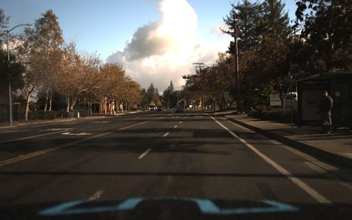
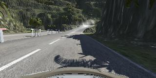
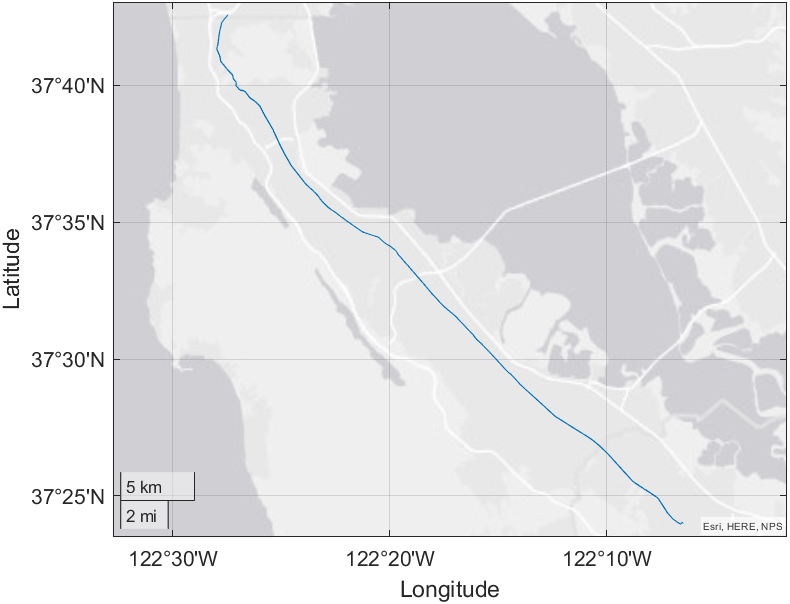
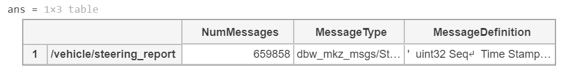
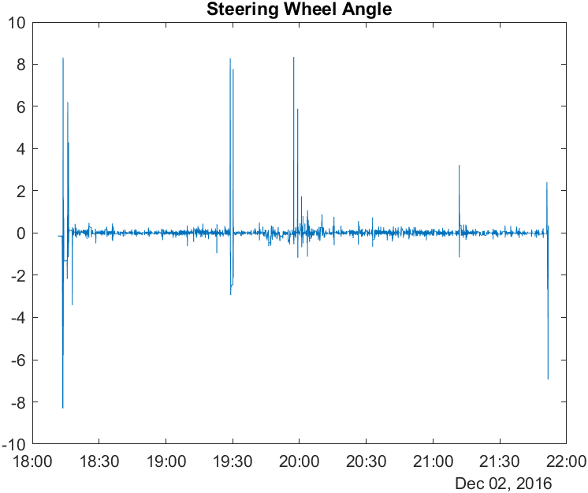
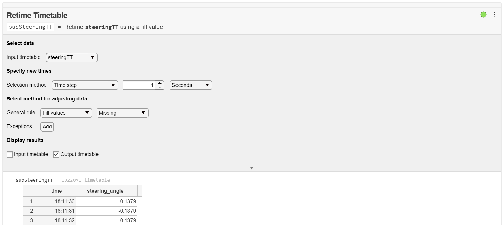
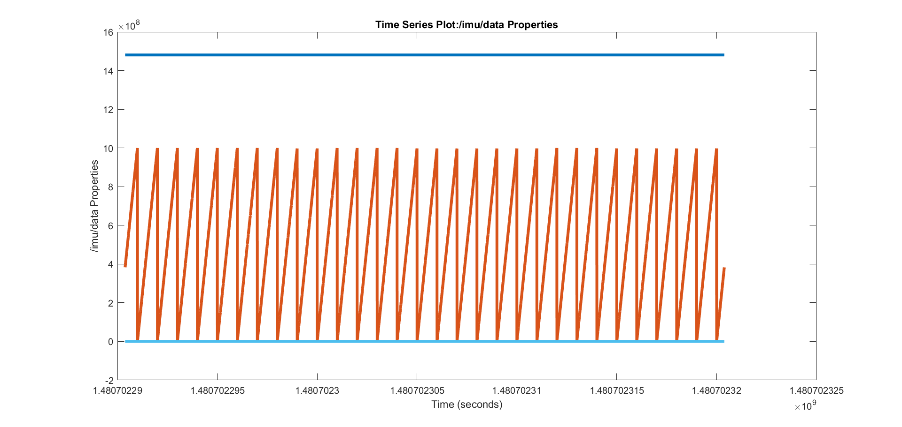
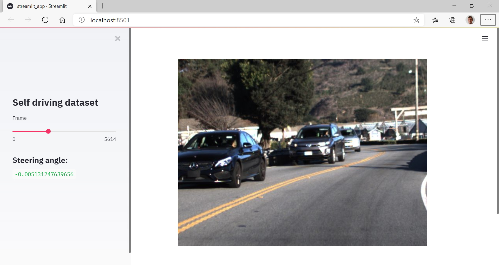
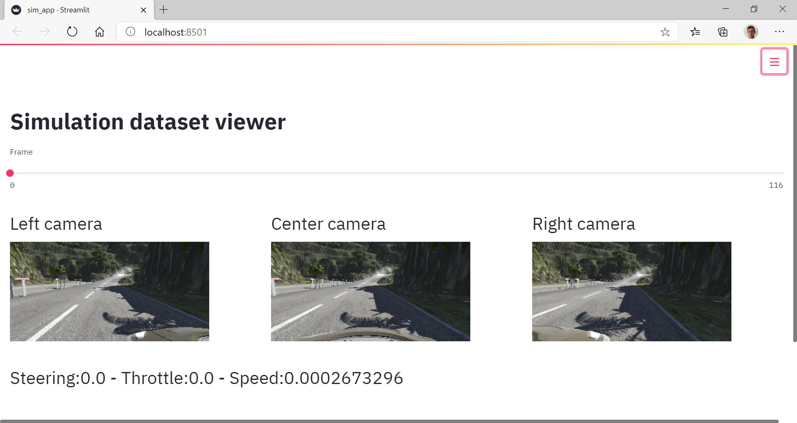

# self-driving

This project starts with [223GB of Driving Data](https://medium.com/udacity/open-sourcing-223gb-of-mountain-view-driving-data-f6b5593fbfa5) open sourced by Udacity.
The originial idea was to hack this driving [dataset](https://github.com/udacity/self-driving-car), the associated [app](https://github.com/streamlit/demo-self-driving/blob/master/streamlit_app.py) and [data hosted on AWS](https://streamlit-self-driving.s3-us-west-2.amazonaws.com/) by Streamlit

Hybrid training of a self-driving car, based on both images from:

| real driving data                                | simulation data                                  | 
| -------------------------------------------------|:------------------------------------------------:|
|  |  |


For more project on autonomous driving simulation:
* https://github.com/slevin48/gta
* https://github.com/slevin48/carla

## Real driving data

[Youtube - Neural Network driving a car](https://www.youtube.com/watch?v=NJU9ULQUwng&feature=emb_logo&ab_channel=IProgrammerTV)


### Dataset

First Download the [Driving Datasets](https://github.com/udacity/self-driving-car/tree/master/datasets) – Over 10 hours of driving data (LIDAR, camera frames and more)

```
aria2c Ch2_001.tar.gz-692ee7e0c63fb2212bfe4a62a39ce71ee9b16fb3.torrent
```
Read [How to download torrents from the command-line on Linux](https://www.addictivetips.com/ubuntu-linux-tips/download-torrents-from-the-command-line-linux/)

Untar

```
tar -xf Ch2_001.tar.gz
```

### [udacity-driving-reader](https://github.com/rwightman/udacity-driving-reader)

Build the docker
```
docker build -t udacity-reader .
```
Run the ROS bag reader
```
./run-bagdump.sh -i /data -o /output
```

### MATLAB ROS toolbox

[MATLAB rosbag Structure](https://www.mathworks.com/help/ros/ug/ros-log-files-rosbags.html):


[work-with-rosbag-logfiles](https://www.mathworks.com/help/ros/ug/work-with-rosbag-logfiles.html)

```matlab
>> bag = rosbag('CH03_002')

  BagSelection with properties:

           FilePath: 'C:\Users\slevin\Downloads\self-driving\CH3_002\CH03_002'
          StartTime: 1.4807e+09
            EndTime: 1.4807e+09
        NumMessages: 54456557
    AvailableTopics: [36×3 table]
    AvailableFrames: {0×1 cell}
        MessageList: [54456557×4 table]
```
Available Topics:
```
/can_bus_dbw/can_rx                                 9376489 msgs    : dataspeed_can_msgs/CanMessageStamped 
/center_camera/camera_info                           264230 msgs    : sensor_msgs/CameraInfo               
/center_camera/image_color/compressed                264230 msgs    : sensor_msgs/CompressedImage          
/diagnostics                                          52540 msgs    : diagnostic_msgs/DiagnosticArray       (4 connections)
/ecef/                                              5287720 msgs    : geometry_msgs/PointStamped           
/fix                                                5287720 msgs    : sensor_msgs/NavSatFix                
/imu/data                                           5287726 msgs    : sensor_msgs/Imu                      
/left_camera/camera_info                             264276 msgs    : sensor_msgs/CameraInfo               
/left_camera/image_color/compressed                  264276 msgs    : sensor_msgs/CompressedImage          
/pressure                                            660965 msgs    : sensor_msgs/FluidPressure            
/right_camera/camera_info                            263840 msgs    : sensor_msgs/CameraInfo               
/right_camera/image_color/compressed                 263840 msgs    : sensor_msgs/CompressedImage          
/time_reference                                    16020574 msgs    : sensor_msgs/TimeReference            
/vehicle/brake_info_report                           660965 msgs    : dbw_mkz_msgs/BrakeInfoReport         
/vehicle/brake_report                                659917 msgs    : dbw_mkz_msgs/BrakeReport             
/vehicle/dbw_enabled                                      1 msg     : std_msgs/Bool                        
/vehicle/filtered_accel                              659858 msgs    : std_msgs/Float64                     
/vehicle/fuel_level_report                           132671 msgs    : dbw_mkz_msgs/FuelLevelReport         
/vehicle/gear_report                                 263943 msgs    : dbw_mkz_msgs/GearReport              
/vehicle/gps/fix                                      13219 msgs    : sensor_msgs/NavSatFix                
/vehicle/gps/time                                     13219 msgs    : sensor_msgs/TimeReference            
/vehicle/gps/vel                                      13219 msgs    : geometry_msgs/TwistStamped           
/vehicle/imu/data_raw                               1318634 msgs    : sensor_msgs/Imu                      
/vehicle/joint_states                               1981787 msgs    : sensor_msgs/JointState               
/vehicle/misc_1_report                               263944 msgs    : dbw_mkz_msgs/Misc1Report             
/vehicle/sonar_cloud                                  66768 msgs    : sensor_msgs/PointCloud2              
/vehicle/steering_report                             659858 msgs    : dbw_mkz_msgs/SteeringReport          
/vehicle/surround_report                              66768 msgs    : dbw_mkz_msgs/SurroundReport          
/vehicle/suspension_report                           661052 msgs    : dbw_mkz_msgs/SuspensionReport        
/vehicle/throttle_info_report                       1321946 msgs    : dbw_mkz_msgs/ThrottleInfoReport      
/vehicle/throttle_report                             659914 msgs    : dbw_mkz_msgs/ThrottleReport          
/vehicle/tire_pressure_report                         26438 msgs    : dbw_mkz_msgs/TirePressureReport      
/vehicle/twist_controller/parameter_descriptions          1 msg     : dynamic_reconfigure/ConfigDescription
/vehicle/twist_controller/parameter_updates               1 msg     : dynamic_reconfigure/Config           
/vehicle/wheel_speed_report                         1321929 msgs    : dbw_mkz_msgs/WheelSpeedReport        
/velodyne_packets                                    132079 msgs    : velodyne_msgs/VelodyneScan
```

**GPS**
```matlab
bagGps = select(bag, 'Topic', '/vehicle/gps/fix');
```


**Steering Angle**
```matlab
bagSteering = select(bag, 'Topic', '/vehicle/steering_report');
```
```matlab
bagSteering.AvailableTopics
```


```matlab
msgs = readMessages(bagSteering,'DataFormat','struct');
steering_angle = cellfun(@(m) m.SteeringWheelAngle,msgs);
Sec = cellfun(@(m) m.Header.Stamp.Sec,msgs);
Nsec = cellfun(@(m) m.Header.Stamp.Nsec,msgs);
time = datetime(Sec,"ConvertFrom","epochtime","Format","HH:mm:ss");
plot(time,steering_angle)
title("Steering Wheel Angle")
```



**Retime:** sub-sample to one point per second to sync with GPS



**Pressure**
```matlab
>> bagpressure = select(bag, 'Topic', '/pressure')
bagpressure = 

  BagSelection with properties:

           FilePath: 'C:\Users\slevin\Downloads\self-driving\CH3_002\CH03_002'
          StartTime: 1.4807e+09
            EndTime: 1.4807e+09
        NumMessages: 660965
    AvailableTopics: [1×3 table]
    AvailableFrames: {0×1 cell}
        MessageList: [660965×4 table]
```
IMU (Inertial Measurement Unit)
```matlab
>> bagselect1 = select(bag, 'Topic', '/imu/data')

bagselect1 = 

  BagSelection with properties:

           FilePath: 'C:\Users\slevin\Downloads\self-driving\CH3_002\CH03_002'
          StartTime: 1.4807e+09
            EndTime: 1.4807e+09
        NumMessages: 5287726
    AvailableTopics: [1×3 table]
    AvailableFrames: {0×1 cell}
        MessageList: [5287726×4 table]
```

We have more than 5 million messages, so we will filter to get only the first 30 seconds:

```matlab
>> start = bag.StartTime;
>> bagselect2 = select(bag, 'Time', [start start + 30], 'Topic', '/imu/data')

bagselect2 = 

  BagSelection with properties:

           FilePath: 'C:\Users\slevin\Downloads\self-driving\CH3_002\CH03_002'
          StartTime: 1.4807e+09
            EndTime: 1.4807e+09
        NumMessages: 12001
    AvailableTopics: [1×3 table]
    AvailableFrames: {0×1 cell}
        MessageList: [12001×4 table]
```

Read selected message data
```matlab
>> msgs = readMessages(bagselect2);
>> msgs{1}

ans = 

  ROS Imu message with properties:

                     MessageType: 'sensor_msgs/Imu'
                          Header: [1×1 Header]
                     Orientation: [1×1 Quaternion]
                 AngularVelocity: [1×1 Vector3]
              LinearAcceleration: [1×1 Vector3]
           OrientationCovariance: [9×1 double]
       AngularVelocityCovariance: [9×1 double]
    LinearAccelerationCovariance: [9×1 double]

  Use showdetails to show the contents of the message
```
Read as timeseries
```matlab
>> ts = timeseries(bagselect2)
  timeseries

  Common Properties:
            Name: '/imu/data Properties'
            Time: [12001x1 double]
        TimeInfo: [1x1 tsdata.timemetadata]
            Data: [12001x13 double]
        DataInfo: [1x1 tsdata.datametadata]

  More properties, Methods
```
```matlab
figure
plot(ts, 'LineWidth', 3)
```


### S3 hosting

Host the real driving dataset on AWS S3 bucket, and [allow public access to the bucket](https://havecamerawilltravel.com/photographer/how-allow-public-access-amazon-bucket/)  

Access Photos from Python, by building a list ([save list to CSV](https://www.geeksforgeeks.org/python-save-list-to-csv/))
```python
import os
import pandas as pd
list = os.listdir()
df = pd.DataFrame(list,columns=['photo'])
df.to_csv('photos.csv',index=False)
```

Display frames & steering angle with a streamlit app:



```
streamlit run car_app.py
```

## Simulated driving data

[self-driving-car-simulator](https://github.com/udacity/self-driving-car-sim)




```
streamlit run car_app.py
```

(Turn on wide mode in settings in the upper right of the app)

## KITTI: precursor self-driving dataset

From the Karlsruhe Institute of Technology:
* [**Paper** - Vision meets Robotics: The KITTI Dataset](https://www.mrt.kit.edu/z/publ/download/2013/GeigerAl2013IJRR.pdf)
* [KITTI Vision Benchmark Suite](http://www.cvlibs.net/datasets/kitti/)


## Resources:
* https://github.com/tawnkramer/sdsandbox
* https://github.com/naokishibuya/car-behavioral-cloning
* https://github.com/llSourcell/How_to_simulate_a_self_driving_car
* https://github.com/ManajitPal/DeepLearningForSelfDrivingCars
* https://www.youtube.com/watch?v=EaY5QiZwSP4&ab_channel=SirajRaval
* https://developer.nvidia.com/blog/deep-learning-self-driving-cars/


